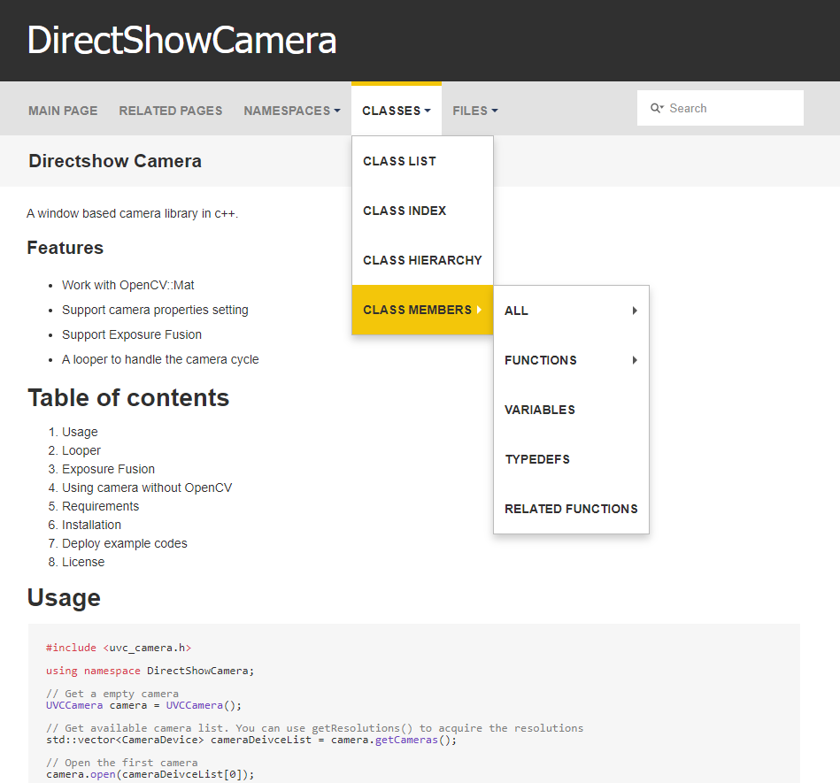
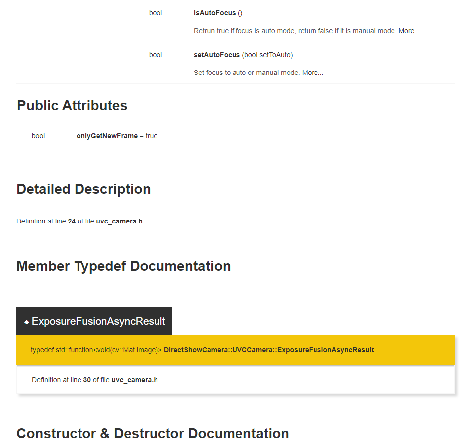

# Doxygen Theme - Flat Design

See [Example 1](https://kcwongjoe.com/directshow_camera/), [Example 2](https://kcwongjoe.com/serial_port/)

## Sample image 1

## Sample image 2

# Requirements

Doxygen 1.8.20

# How to use

1.  Download Doxywizard
2.  Go to Expert > HTML > HTML_EXTRA_STYLESHEET

    Add **src/doxygen-style.css**

3.  Go to Expert > HTML > HTML_EXTRA_FILES

    Add all the images from the **src/img** folder

# How to change the color pattern and style

1. Open **src/doxygen-style.css**

2. Modifiy variables in **.root**.

# License
This project is licensed under [MIT](LICENSE) license.